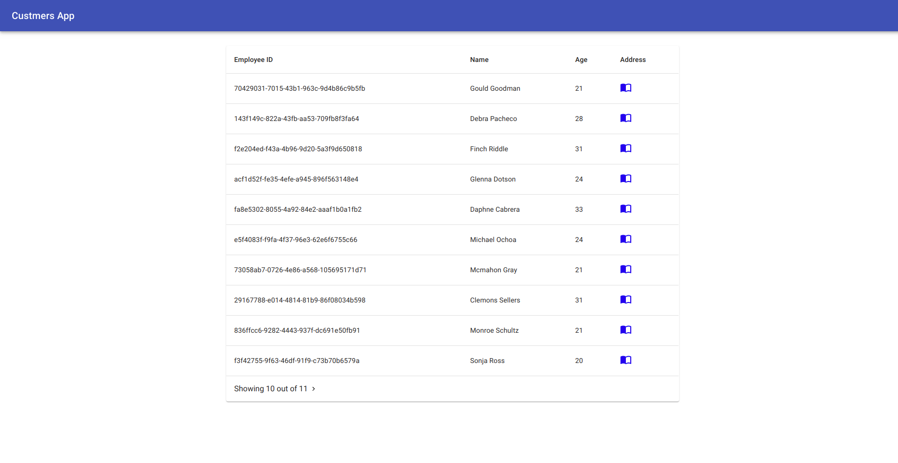
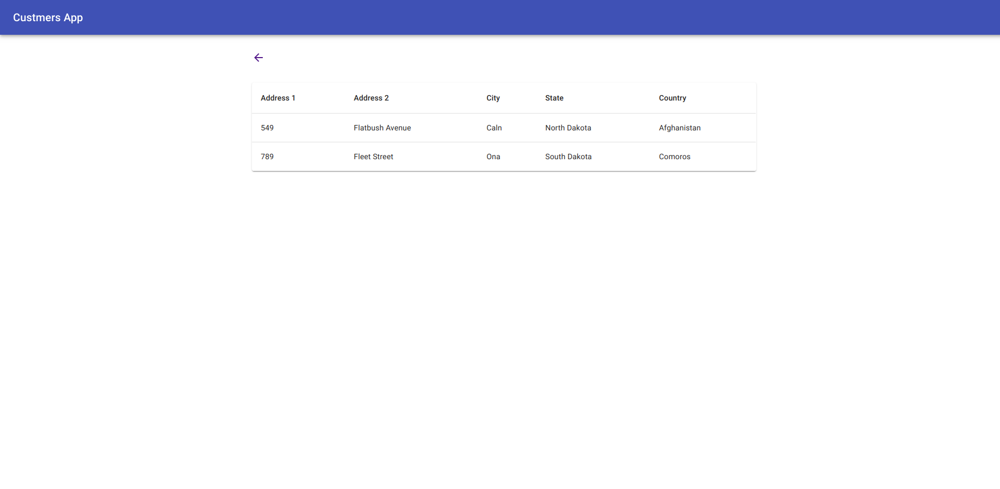

# Customer App 

The Aim of the Application is to demonstrate the app written in typescript with React in frontend and NodeJS in backend.

## What it does

This is the unauthenticated app which shows the list of the customers. On click of address icon, it shows all the addresses of the customer

## Prerequisite

- Docker and docker compose must be installed in your pc.

## How to use
1. Run script `sh docker-up.sh`
2. Run script `sh loaddependencies.sh`
3. Run command `yarn start-production` 
4. Hit Url `http://localhost:3001`

## Technologies used

### Fronend

- React (source taken from create-react-app)
- Redux
- Redux-Thunk (Middleware)

### Backend

- Koa
- Mongoose (ORM for MongoDB)

### Deployment

- Docker
- Docker compose

### Language

- Typescript (Frontend and backend)

## API Design

API doc link - https://customerapp.docs.stoplight.io

- [GET /api/customer/:id](https://customerapp.docs.stoplight.io/new-subpage/customers/getcustomerid) 
- [GET /api/customers](https://customerapp.docs.stoplight.io/new-subpage/customers/getcustomers)

## Database Design

- CustomerCollection

```
{
    _id: primarykey
    employeeID: string,
    name: string,
    age: number,
    addresses: [
        {
            address1: string,
            address2: string,
            city: string,
            state: string,
            country: string
        }
    ]
}
```

## Screenshots

1. Customers list 



2. Customer Addresses


